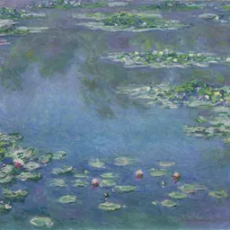
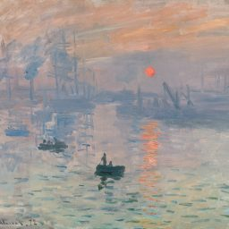
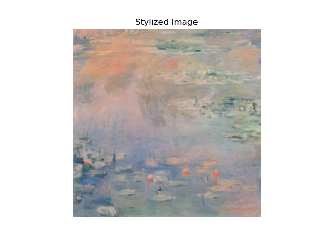

# 🎨 Neural Style Transfer with PyTorch

This project implements the classic **Neural Style Transfer** algorithm proposed by *Gatys et al. (2015)* using PyTorch and a pretrained **VGG19** network. It combines the **content** of one image with the **style** of another to produce a visually striking result.

---

## 🧠 Method

The model:
- Extracts **content features** and **style features** using layers of VGG19
- Computes **content loss** and **style loss** (via Gram matrices)
- Optimizes a copy of the content image to match the target style and content using **L-BFGS**

> 📄 Reference:  
> [A Neural Algorithm of Artistic Style](https://arxiv.org/abs/1508.06576) – *Gatys, Ecker, Bethge (2015)*

---

## 📁 Project Structure

```
.
├── main.py               # Core script
├── Testin/               # Folder for test images
│   ├── content_4.jpg     # Content image
│   ├── style_4.jpg       # Style image
├── FinalResult.jpg       # Stylized result (auto-generated)
├── README.md             # This file
```

---

## 🚀 Usage

### 1. ✅ Install environment

```bash
conda create -n style-transfer python=3.10 -y
conda activate style-transfer
conda install pytorch torchvision torchaudio pytorch-cuda=11.8 -c pytorch -c nvidia
pip install matplotlib pillow
```

> ✅ Supports GPU acceleration via CUDA

---

### 2. 📸 Prepare your images

Put your content and style image into the `Testin/` folder, and make sure `main.py` points to the correct filenames:

```python
content_img, style_img = preprocess_images("Testin/content_4.jpg", "Testin/style_4.jpg")
```

---

### 3. ▶️ Run the program

```bash
python main.py
```

Output:
- Logs during optimization (Step 0, Step 50...)
- A final image saved as `FinalResult.jpg`
- Output displayed via `matplotlib`

---

## 🖼 Example

| Content | Style | Output                    |
|---------|-------|---------------------------|
|  |  |  |

---

## 🔧 Features

- ✅ PyTorch implementation
- ✅ GPU acceleration supported
- ✅ Adjustable loss weights (`style_weight`, `content_weight`)
- ✅ Simple image preprocessing
- ✅ Optional high-res upscaling (if used with double-pass logic)

---

## 📌 Notes

- Style weight default: `1e6`, content weight: `1`
- Default image size is rescaled to ≤512px (recommended for quality/performance balance)
- You can tweak number of optimization steps in `run_style_transfer(...)`

---

## 📜 License

MIT License — feel free to use this code for academic learning and personal experiments.

---

## 👨‍💻 Author

Project by Huigang Qu & Qinlong Liu. 
Feel free to fork or contact us for improvements!
